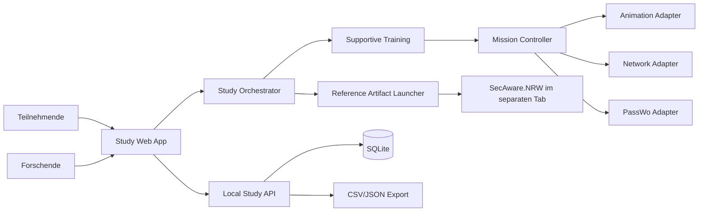
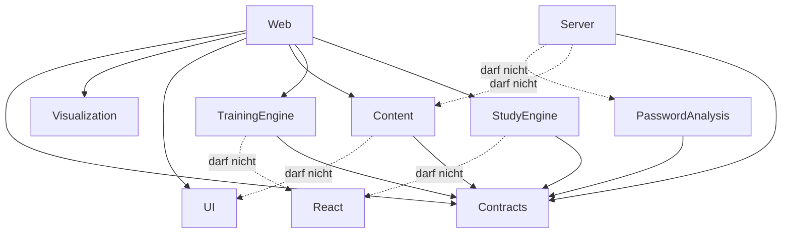

# Softwarearchitektur

## Architekturziele

1. Trainingsmechaniken austauschbar halten, ohne Content oder Studienlogik umzuschreiben.
2. Forschungsdaten strikt von temporärem Trainingszustand trennen.
3. Komplexe Abläufe explizit, testbar und reproduzierbar modellieren.
4. Einen lokalen Studienbetrieb ohne Cloud, externe Analytics oder reale Kontozugriffe erlauben.

## Systemkontext



## Monorepo-Schnitt

```text
apps/
  study-web/       Routes, Teilnehmer-/Forschendenoberflächen und konkrete Browseradapter;
                   keine SQL- oder Randomisierungslogik
  study-server/    lokales API, verdeckte Zuweisung, SQLite und Export; keine Anzeigenamen
                   oder Trainingsinputs
packages/
  contracts/       erlaubte API- und Domänenschemas
  study-engine/    reine Ablauf- und Timerlogik ohne React, Fetch oder Speicherung
  training-engine/ Missionszustandsautomat und deklaratives Animationsprotokoll
  training-content/versionierte Segmentdaten, Teilnehmertexte, Szenenreferenzen und
                   Traceability; Änderungen benötigen fachliche Prüfung
  password-analysis/ reine, deterministische Heuristiken für fiktive Simulationen;
                   kein Produktions-Passwortmeter und keine absolute Bewertung
  visualization/   frameworkfreie Knoten-, Kanten-, Status- und Layoutmodelle
  ui/              Design Tokens, BrowserShell, Bedienelemente, Sprechblase und
                   PassWo-Platzhalter; keine Trainingslogik oder Forschungsdatenspeicherung
```

## Dependency Rules



## Zustandsverantwortung

- **Study Orchestrator:** Einwilligung, Sitzung, Pre, Anzeigename, Bedingung, Artefakt, Post,
  Guardrail, Debrief und Abschluss.
- **Training Mission Controller:** Segment- und Schrittfolge innerhalb des eigenen Artefakts.
- **Scene state:** Browser-Tabs, PassWo-Pose, Netzwerkzustand und Animationssequenz.
- **React:** Projektion des aktuellen Snapshots; kein versteckter Workflow in Effects.
- **Server:** Session, Zuweisung, Timing, Antworten und Export; kein Trainingswissen.

## Ports und Adapter

| Port | Domänenzweck | Erster Adapter | Austauschmöglichkeit |
|---|---|---|---|
| `AnimationPlayerPort` | deklarative Sequenzen ausführen | Motion | Web Animations/Rive |
| `CharacterRendererPort` | PassWo-Pose und Platzierung | PNG/CSS + Motion | Rive/SVG-Layer |
| `NetworkRendererPort` | Kontennetz visualisieren | React Flow | eigenes SVG/Canvas |
| `StudyRepositoryPort` | erlaubte Studiendaten schreiben | Fastify HTTP | In-Memory-Testadapter |
| `ReferenceLauncherPort` | externe Bedingung öffnen | neuer Browser-Tab | betreuter Kioskmodus |
| `TimingSink` | Zeitereignisse persistieren | Study API | In-Memory-Testadapter |

Adaptertypen dürfen nicht in Content- oder Engine-Schemas erscheinen.

## Fehlerstrategie

- Forschungsdatenfehler werden sichtbar und blockierend behandelt; kein stilles „best effort“.
- Animationsfehler dürfen den Lernpfad nicht blockieren: sofort auf Endzustand springen und
  `continue` erlauben.
- Externe Referenzseite nicht erreichbar: Sitzung als technischer Abbruch markieren, nicht als
  regulären Abschluss.
- Reload während des Trainings: temporärer Zustand wird verworfen; Sitzung erhält einen
  unvollständigen technischen Status.

## Deployment für die Studie

- Ein lokaler Node-Prozess bindet standardmäßig nur an `127.0.0.1`.
- Fastify liefert den Vite-Build und die API aus derselben Origin aus.
- SQLite liegt außerhalb des Repositories in einem lokalen Verzeichnis mit restriktiven Rechten.
- Keine CDN-Schriften, externen Skripte, Telemetrie oder Service Worker.
