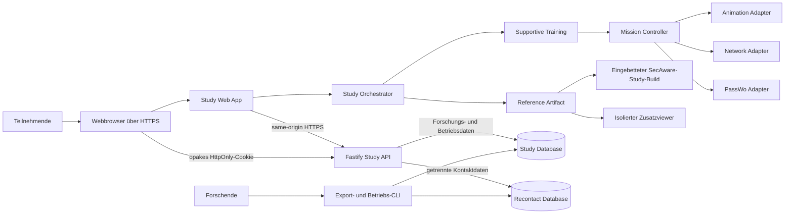
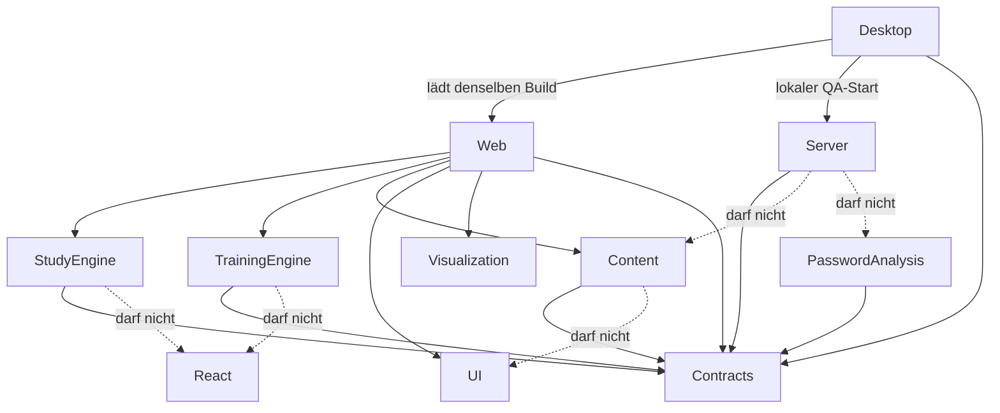

# Softwarearchitektur

## Architekturziele

1. Trainingsmechaniken austauschbar halten, ohne Content oder Studienlogik umzuschreiben.
2. Forschungsdaten strikt von flüchtigem Trainingszustand trennen.
3. Komplexe Abläufe explizit, testbar und reproduzierbar modellieren.
4. Die Hauptstudie same-origin im Web betreiben und unterbrochene Sitzungen ohne Persistenz von
   Trainingswerten fortsetzen.
5. Die bestehende Electron-Hülle als lokalen Entwicklungs- und QA-Pfad erhalten, ohne eine zweite
   fachliche Runtime aufzubauen.

## Zielkontext der Hauptstudie



Web-Renderer und API teilen eine Origin. Der Browser hält ausschließlich einen opaken
Rückkehrschlüssel als `Secure`, `HttpOnly`, first-party Cookie. Die API persistiert nur dessen Hash
und einen inhaltsfreien Fortschritts-Checkpoint. Fiktive Passwörter, Passwortteile, Anzeigenamen,
lokale Findings und Trainingsentscheidungen bleiben im flüchtigen Rendererzustand.

## Aktueller lokaler Entwicklungsstand

`apps/study-desktop` kann den vorhandenen Renderer und Server weiterhin lokal starten. Der
implementierte Lease-/`incomplete-reload`-Pfad ist Legacy-Verhalten für diesen lokalen Stand. Vor
dem Hauptstudien-Versions-Freeze sind Webdeployment, Resume-Cookie, Checkpointing und
unterbrechungsfähiges Timing gemäß `ADR 0016-Web-Resume-Lifecycle` umzusetzen. Diese noch offene
Implementierung öffnet die bereits getroffene Betriebsentscheidung nicht erneut.

## Monorepo-Schnitt

```text
apps/
  study-desktop/   Electron-Hülle für lokalen Entwicklungs-, Packaging- und QA-Betrieb;
                   keine Forschungs- oder Trainingslogik
  study-web/       Routes, Teilnehmer-/Forschendenoberflächen und konkrete Browseradapter;
                   keine SQL- oder Randomisierungslogik
  study-server/    API, verdeckte Zuweisung, Persistenz, Wiederaufnahme, Follow-up und Export;
                   keine Anzeigenamen, Trainingsinputs oder Passwortbefunde
packages/
  contracts/       erlaubte API- und Domänenschemas sowie bereinigte Instrument-Runtime
  study-engine/    reine Ablauf- und Timerlogik ohne React, Fetch oder Speicherung
  training-engine/ Missionszustandsautomat und deklaratives Animationsprotokoll
  training-content/versionierte Segmentdaten, Teilnehmertexte, Szenenreferenzen und
                   Traceability; Änderungen benötigen fachliche Prüfung
  password-analysis/ reine lokale Heuristiken für fiktive Simulationen; keine Serverabhängigkeit
  visualization/   frameworkfreie Knoten-, Kanten-, Status- und Layoutmodelle
  ui/              Design Tokens, BrowserShell und DesktopSurface; keine Trainingslogik oder
                   Forschungsdatenspeicherung
```

## Dependency Rules



## Zustandsverantwortung

- **Study Orchestrator:** Einwilligung, optionale Recontact-Registrierung, Session, Pre, Anzeigename,
  Bedingung, Artefakt, Post, Guardrail, Debriefing und regulärer Abschluss.
- **Training Mission Controller:** Segment- und Schrittfolge innerhalb des supportive Artefakts.
- **Scene state:** Browser-Tabs, PassWo-Pose, Netzwerkzustand, flüchtige fiktive Eingaben und
  Animationssequenz.
- **React:** Projektion des aktuellen Snapshots; kein versteckter Workflow in Effects.
- **Server:** Session, getrennte Condition-/Guardrail-Zuweisung, atomare Instrument-Submissions,
  Timingintervalle, inhaltsfreier Checkpoint, Hash des Rückkehrschlüssels, getrennte
  Recontact-Registry, same-origin Follow-up und Export; kein Trainingswissen.

## Wiederaufnahmegrenze

Ein bestätigter Checkpoint bezeichnet ausschließlich einen sicheren Wiedereinstieg, etwa den
nächsten Fragebogenabschnitt oder den Beginn eines Trainingssegments. Er ist keine serialisierte
Kopie des Clientzustands.

- Atomar gespeicherte Fragebogenblöcke werden nicht erneut erhoben.
- Ein unterbrochener Trainingsschritt mit flüchtigen Werten beginnt erneut.
- Schließen oder Reload setzt eine neue Web-Sitzung nicht auf `incomplete-reload`.
- Nur der reguläre letzte Abschluss setzt `completed`.
- Auswertung und Archivbildung selektieren ausschließlich `completed` Runs.

## Ports und Adapter

| Port | Domänenzweck | Erster Adapter | Austauschmöglichkeit |
|---|---|---|---|
| `AnimationPlayerPort` | deklarative Sequenzen ausführen | Motion | Web Animations/Rive |
| `CharacterRendererPort` | PassWo-Pose und Platzierung | PNG/CSS + Motion | Rive/SVG-Layer |
| `NetworkRendererPort` | Kontennetz visualisieren | React Flow | eigenes SVG/Canvas |
| `StudyRepositoryPort` | erlaubte Studiendaten schreiben | Fastify HTTP | In-Memory-Testadapter |
| `TimingSink` | aktive Zeitintervalle persistieren | Study API | In-Memory-Testadapter |
| `ResumeSessionPort` | opaken Rückkehrschlüssel und sicheren Checkpoint auflösen | Study API + HttpOnly-Cookie | In-Memory-Testadapter |

Adaptertypen dürfen nicht in Content- oder Engine-Schemas erscheinen.

## Fehlerstrategie

- Forschungsdatenfehler werden sichtbar und blockierend behandelt; kein stilles „best effort“.
- Animationsfehler dürfen den Lernpfad nicht blockieren: auf Endzustand springen und `continue`
  erlauben.
- Ein nicht erreichbares Referenzartefakt erzeugt einen technischen Fehler und keinen regulären
  Abschluss.
- Browser- oder Netzunterbrechung beendet das aktuelle aktive Zeitintervall. Nach Wiederaufnahme
  beginnt ein neues Intervall am letzten sicheren Checkpoint; Offline-Zeit wird nicht mitgezählt.
- Geht der Rückkehrschlüssel verloren, wird keine Sitzung über E-Mail, Antworten oder Forschungs-ID
  gesucht. Die Person kann neu beginnen oder mit dem Löschcode die alte Sitzung löschen lassen.

## Deployment

### Hauptstudie

- Same-origin Webanwendung über HTTPS.
- Keine CDN-Schriften, externen Skripte, Telemetrie oder Service Worker.
- Kein JavaScript-lesbarer Browser Storage für Teilnehmer- oder Trainingszustand.
- Datenbank und Exporte liegen in einem zugriffsbeschränkten Projektbereich; Kontaktregister und
  Forschungsdaten bleiben getrennt. Projektkontrollierte Reverse-Proxy- und Anwendungslogs
  speichern weder IP-Adressen und User-Agents noch tokenisierte URLs oder Raw Tokens.
- Die Nachbefragung läuft als tokenisierte Route derselben Webanwendung. E-Mail-Versand erfolgt
  kontrolliert über das Universitätskonto; die Anwendung enthält keine Mail-Credentials.

### Lokale Entwicklung und QA

- Electron startet denselben Web-Build und die vorhandene Study API lokal.
- Electron-Sondercode bleibt auf Fenster-/App-Lifecycle, Sandbox/Berechtigungen, schmale typisierte
  Preload-/IPC-Ports, isolierten Zusatzviewer und Packaging begrenzt.
- Das Design Lab bleibt ein interner QA-Pfad ohne Forschungsdatenspeicherung.

## Datenabschluss

Architektur und Runtime unterscheiden drei Zeitpunkte:

1. Hauptstudien-Versions-Freeze vor Rekrutierungsbeginn.
2. Datenerhebungsschluss für neue und wiederaufgenommene Hauptsitzungen.
3. Datensatz-Freeze mit Entfernung unvollständiger Runs, Löschung der Zuordnungsinformationen und
   Erzeugung des anonymen Archivdatensatzes.

Die verbindliche Prozedur und Frist stehen ausschließlich in `docs/research/DATA-CONTRACT.md`.
