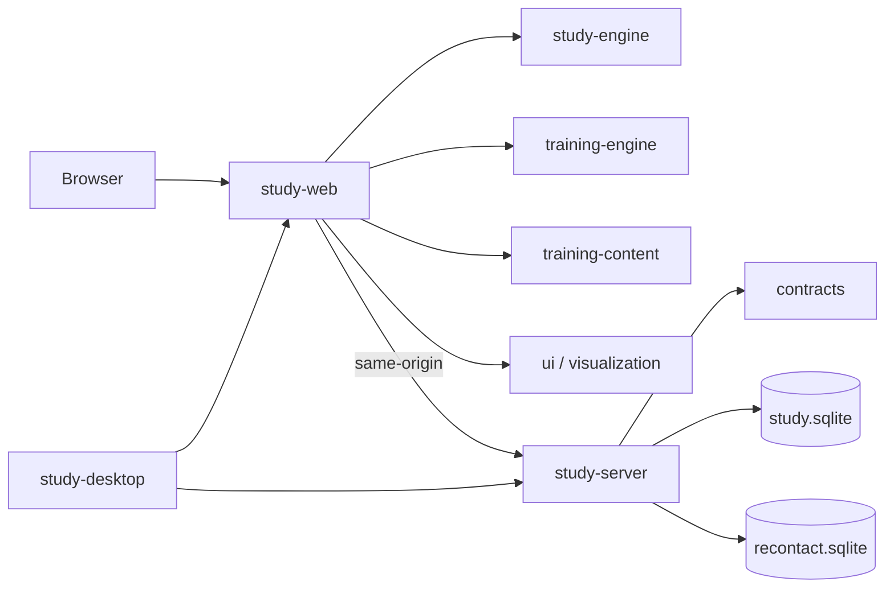

# Softwarearchitektur

## Systemgrenze

PassWo ist eine same-origin Webstudie. React rendert Zustände; frameworkfreie Maschinen treffen
Ablaufentscheidungen; Fastify persistiert ausschließlich erlaubte Forschungs- und Betriebsdaten.
Die Electron-App lädt denselben Web-Build und Server als lokalen QA-Harness.

## Verantwortungen

| Modul | Verantwortung | Verboten |
|---|---|---|
| `study-web` | Routes, Projektion, Browseradapter | SQL, Randomisierung, duplizierter Workflow |
| `study-server` | Session, Zuweisung, Persistenz, Resume, Timing, Follow-up, Export | Trainingscontent, Passwortanalyse |
| `study-engine` | Studienablauf und Timerlogik | React, Fetch, Speicherung |
| `training-engine` | Missionszustand und Animationsprotokoll | React, konkrete Renderer |
| `training-content` | versionierte Segmente und Texte | UI-Komponenten |
| `password-analysis` | deterministische lokale Übungsanalyse | Serverzugriff, Produktionsbewertung |
| `visualization` | Knoten-, Kanten- und Layoutmodelle | Forschungslogik |
| `ui` | Tokens, BrowserShell, DesktopSurface | Workflow und Persistenz |

Der Server importiert aus dem gemeinsamen Domain-Layer ausschließlich `@passwo/contracts`.
Training Content und Engines bleiben frameworkfrei. Motion, React Flow, PassWo und das
Referenzartefakt liegen hinter Ports oder Adaptern.

## Zustandsmodell

- Die Study-Maschine steuert Einwilligung, Session, Instrumente, Bedingung, Artefakt, Guardrail,
  Debriefing und Abschluss.
- Die Training-Maschine steuert S00–S17 und pädagogische Sequenzen.
- Szenenzustand enthält ausschließlich flüchtige Browser-, PassWo-, Netzwerk- und Übungswerte.
- React besitzt keinen parallelen Workflow in Effects oder globalen Bool-Flags.
- Der Server kennt keine Anzeigenamen, Passwortwerte oder lokalen Trainingsbefunde.

Ein bestätigter Checkpoint bezeichnet einen sicheren Wiedereinstieg, keine serialisierte
Clientkopie. Fragebogenblöcke werden atomar gespeichert. Bis S07 ist nur der in ADR 0016 definierte
tab-lokale Reload-Snapshot zulässig; ab S08 werden ausschließlich vorgegebene Content-IDs,
kanonische Flags und eine inhaltsfreie Segment-ID verwendet. `localStorage`, IndexedDB und Service
Worker speichern keinen Teilnehmer- oder Trainingszustand.

## Renderer und Layout

| Port | Aktueller Adapter |
|---|---|
| `AnimationPlayerPort` | Motion |
| `CharacterRendererPort` | lokale Rasterassets + CSS/Motion |
| `NetworkRendererPort` | React Flow |
| `StudyRepositoryPort` | Fastify HTTP |
| `TimingSink` | Study API |
| `ResumeSessionPort` | Study API + `HttpOnly`-Cookie |

Adaptertypen erscheinen nicht in Content- oder Engine-Schemas. Reduced Motion stellt denselben
fachlichen Endzustand her. Beide Artefakte verwenden den gemeinsamen Full-Bleed-Viewport aus
ADR 0015; Instrumente und Debriefing bleiben normal responsive.

## Fehler- und Datengrenzen

- Methodisch relevante Writes sind sichtbar blockierend und idempotent wiederholbar.
- Animationsfehler springen auf den definierten Endzustand und blockieren den Lernpfad nicht.
- Ein fehlendes Referenzartefakt ist ein technischer Fehler, kein regulärer Abschluss.
- Browserunterbrechungen schließen das aktuelle Timingintervall; Offline-Zeit zählt nicht mit.
- Verlorene Rückkehrschlüssel werden nicht über E-Mail, Antworten oder Forschungs-ID ersetzt.
- Nur `completed` Runs gelangen in die Analyse.

Verbindliche Details stehen in [STUDY-RUNTIME.md](../research/STUDY-RUNTIME.md),
[DATA-CONTRACT.md](../research/DATA-CONTRACT.md) und im [ADR-Index](adr/README.md).

## Deployment

Nginx terminiert HTTPS und leitet API und Web-Build an den nur auf `127.0.0.1` gebundenen Server
weiter. Forschungsdatenbank und Kontaktregister bleiben getrennt. Externe Schriften, Skripte,
Telemetrie und Service Worker sind ausgeschlossen. Die lokale Electron-Hülle fügt keine zweite
fachliche Runtime hinzu. Das Betriebsverfahren steht in
[WEB-DEPLOYMENT.md](../operations/WEB-DEPLOYMENT.md).
