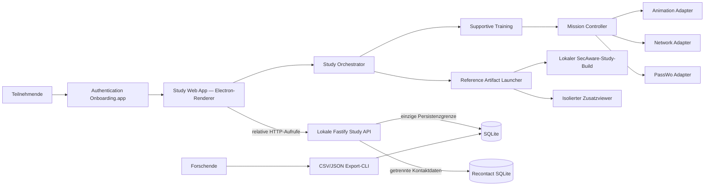
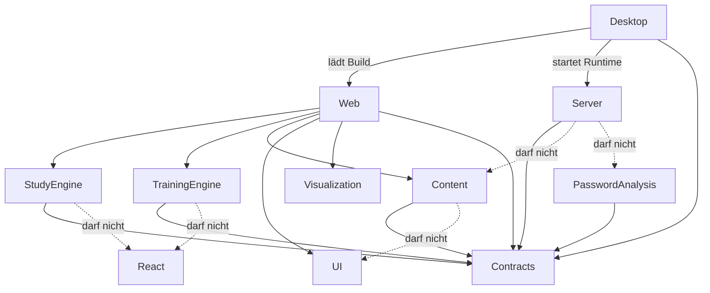

# Softwarearchitektur

## Architekturziele

1. Trainingsmechaniken austauschbar halten, ohne Content oder Studienlogik umzuschreiben.
2. Forschungsdaten strikt von temporärem Trainingszustand trennen.
3. Komplexe Abläufe explizit, testbar und reproduzierbar modellieren.
4. Einen lokalen Studienbetrieb ohne Cloud, externe Analytics oder reale Kontozugriffe erlauben.

## Systemkontext



## Monorepo-Schnitt

```text
apps/
  study-desktop/   Electron-Hülle, lokaler Runtime-Lifecycle und isolierter Zusatzviewer;
                   keine Forschungs- oder Trainingslogik
  study-web/       Routes, Teilnehmer-/Forschendenoberflächen und konkrete Browseradapter;
                   keine SQL- oder Randomisierungslogik
  study-server/    lokales API, verdeckte Zuweisung, SQLite und Export; keine Anzeigenamen
                   oder Trainingsinputs
packages/
  contracts/       erlaubte API- und Domänenschemas sowie bereinigte Instrument-Runtime
  study-engine/    reine Ablauf- und Timerlogik ohne React, Fetch oder Speicherung
  training-engine/ Missionszustandsautomat und deklaratives Animationsprotokoll
  training-content/versionierte Segmentdaten, Teilnehmertexte, Szenenreferenzen und
                   Traceability; Änderungen benötigen fachliche Prüfung
  password-analysis/ vorbereitete Grenze für reine, deterministische Heuristiken fiktiver
                   Simulationen; noch nicht in den Renderer eingebunden
  visualization/   frameworkfreie Knoten-, Kanten-, Status- und Layoutmodelle
  ui/              Design Tokens, BrowserShell und DesktopSurface; keine Trainingslogik oder
                   Forschungsdatenspeicherung
```

## Dependency Rules



## Zustandsverantwortung

- **Study Orchestrator:** Einwilligung, verpflichtende atomare Recontact-Registrierung, Sitzung, Pre,
  Anzeigename, Bedingung, Artefakt, Post, Guardrail, Session Closure und Abschluss.
- **Training Mission Controller:** Segment- und Schrittfolge innerhalb des eigenen Artefakts.
- **Scene state:** Browser-Tabs, PassWo-Pose, Netzwerkzustand und Animationssequenz.
- **React:** Projektion des aktuellen Snapshots; kein versteckter Workflow in Effects.
- **Server:** Session, getrennte Condition-/Guardrail-Zuweisung, Timing, atomare
  Instrument-Submissions, Präsentationsreihenfolge, getrennte Recontact-Registry und Export; kein
  Trainingswissen.

## Ports und Adapter

| Port | Domänenzweck | Erster Adapter | Austauschmöglichkeit |
|---|---|---|---|
| `AnimationPlayerPort` | deklarative Sequenzen ausführen | Motion | Web Animations/Rive |
| `CharacterRendererPort` | PassWo-Pose und Platzierung | PNG/CSS + Motion | Rive/SVG-Layer |
| `NetworkRendererPort` | Kontennetz visualisieren | React Flow | eigenes SVG/Canvas |
| `StudyRepositoryPort` | erlaubte Studiendaten schreiben | Fastify HTTP | In-Memory-Testadapter |
| `TimingSink` | Zeitereignisse persistieren | Study API | In-Memory-Testadapter |

Adaptertypen dürfen nicht in Content- oder Engine-Schemas erscheinen.

## Fehlerstrategie

- Forschungsdatenfehler werden sichtbar und blockierend behandelt; kein stilles „best effort“.
- Animationsfehler dürfen den Lernpfad nicht blockieren: sofort auf Endzustand springen und
  `continue` erlauben.
- Externe Referenzseite nicht erreichbar: Sitzung als technischer Abbruch markieren, nicht als
  regulären Abschluss.
- Reload während des Trainings: temporärer Zustand wird verworfen; Sitzung erhält einen
  unvollständigen technischen Status.

## Deployment für die Studie

- Teilnehmende starten ausschließlich die lokale arm64-`Authentication Onboarding.app`.
- Electron startet die vorhandene Study Runtime intern auf `127.0.0.1` mit dynamischem Port.
- Fastify liefert den Vite-Build und die API aus derselben Origin aus.
- SQLite bleibt unverändert unter `~/.passwo-study/study.sqlite`.
- Direkte Kontaktdaten liegen ausschließlich in der getrennten
  `~/.passwo-study/recontact.sqlite`; der Forschungsdatenexport liest sie nie.
- Es gibt keinen eigenständigen Browser-Deploymentpfad. Vite und Chromium dienen nur als interne
  Testharnesses; das Design Lab ist ein interner QA-Pfad.
- Electron-Sondercode bleibt auf Fenster-/App-Lifecycle, Sandbox/Berechtigungen, schmale
  typisierte Preload-/IPC-Ports, den isolierten Zusatzviewer und natives Packaging begrenzt.
- Renderer-, Statechart-, API-, Persistenz- und Trainingssysteme werden jeweils einmal in
  `apps/study-web`, `apps/study-server` oder den bestehenden Packages implementiert.
- Keine CDN-Schriften, externen Skripte, Telemetrie oder Service Worker.
