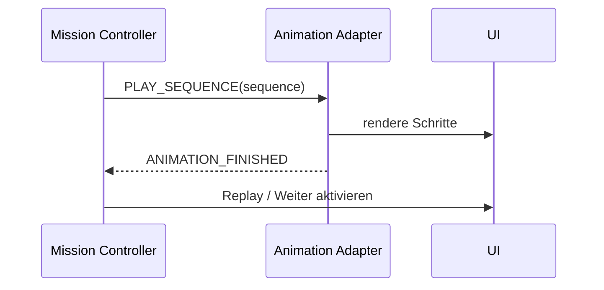

# Animation System

## Ziel

Animationen sind reproduzierbare Lernschritte, nicht dekorative Nebenwirkungen einzelner
Komponenten.

## Domänenmodell

```ts
interface AnimationSequence {
  id: string;
  steps: readonly AnimationStep[];
  reducedMotion: ReducedMotionPlan;
  maxDurationMs: number;
}
```

Typische Steps:

- `move-character`;
- `reveal` / `hide`;
- `highlight`;
- `set-node-status`;
- `draw-edge`;
- `pulse`;
- `wait-for-user`;
- `announce`.

## Handshake



Die Mission wartet niemals auf einen willkürlichen Timeout in einer Komponente. Der Adapter muss
bei Abbruch oder Fehler einen definierten Endzustand herstellen.

## Regeln

- Jede Sequenz hat stabile ID und erwarteten Endzustand.
- Ein Replay erzeugt denselben fachlichen Zustand.
- Zufallsdarstellungen verwenden einen Seed, wenn sie für Tests oder Studienvergleich relevant
  sind.
- Lange Wartephasen sind Contentkonfiguration und nicht im Renderer versteckt.
- Reduced Motion darf keine Information entfernen.
- Animationen können pausiert werden, wenn der Tab verborgen ist; die primäre Artefaktzeit läuft
  dennoch als Wall-Clock weiter.

## Button-Interaktion

Jeder bedienbare Button erhält unabhängig von Größe und visueller Variante ein zurückhaltendes
physisches Feedback: Beim Hover hebt er sich minimal, beim Drücken bewegt er sich leicht zurück
und wird geringfügig skaliert. Das gilt auch für sekundäre, transparente und reine Icon- oder
Info-Buttons. Die globale Button-Basis im Web-Client stellt dieses Verhalten für bestehende und
künftige native Buttons bereit; komponentenspezifische Varianten dürfen es nur bewusst
verfeinern.

Das Feedback verändert weder Farbe noch Form des Buttons, wird nicht auf deaktivierte Buttons
angewendet und verzichtet bei `prefers-reduced-motion` auf Bewegung. Fokusdarstellung und
Tastaturbedienbarkeit bleiben davon unabhängig verpflichtend.

## S06-Datenleckwechsel

Der Wechsel der lokal geprüften Kontoperspektive ist ein eigener Missionsschritt. Zu Beginn wird
nur der neu lokal geprüfte Kontozweig auf den offenen Prüfzustand gesetzt. Bereits bestimmte rote
Paarbeziehungen sowie grüne, durch ein mittiges Schild unterbrochene Schutzbeziehungen bleiben
sichtbar. Der rote Knotenzustand folgt dabei der aktiven Datenleckquelle und nur deren bereits
bestimmten roten Ausgängen; lokal bestimmte blaue Schutzzustände bleiben bestehen. Eine grüne
Paarbeziehung setzt ihren Zielknoten nicht selbst auf blau. Der Angreifer blendet an seiner bisherigen Position
aus, während er ohne Größensprung an der neuen Kontoposition weich eingeblendet wird. Der Abgang
läuft bewusst langsamer; danach bleibt der laufende Angriff ungefähr eine zusätzliche Sekunde
sichtbar, bevor die lokale Markieransicht mit einer kurzen Einblendbewegung folgt. Master Campus
wird von rechts, Campus E-Mail aus einer Warteposition unterhalb des Knotens angegriffen.
Richtung, Länge und Bewegung der gestrichelten Angriffslinie folgen der jeweiligen Position; bei
Campus E-Mail läuft der Flow von unten nach oben. Die generische grüne Knoten-Hervorhebung wird in diesem Ablauf nicht verwendet. Reduced
Motion stellt denselben fachlichen Zielzustand unmittelbar her und öffnet anschließend die
Markieransicht.

Während der Markieransicht sind nur das aktive Konto, seine Unterknoten und internen Verbindungen
sichtbar. Mit dem lokalen Ergebnis kehrt das übrige Netzwerk zurück. Bei einem Fund läuft die
Befallskaskade vom aktuell angegriffenen Konto über alle bereits bestimmten roten Beziehungen zu
den verbundenen Konten und deren Unterknoten; dafür darf die sichtbare Kante temporär entgegen der
ursprünglichen Prüfrichtung laufen. Grüne blockierte Beziehungen bleiben statisch und übertragen
keinen Befall.

Während eines neuen Paarangriffs darf der aktuell angegriffene Knoten seinen vorhandenen blauen
Schutzzustand vorübergehend zugunsten der roten Prüfbewegung verlassen. Nach der Auflösung gilt
wieder der dauerhafte Zustand: Eine erkannte Befallsbeziehung färbt den Kontozweig rot; ein
blockierter Pfad lässt den Zielknoten neutral beziehungsweise in seinem unabhängig bestimmten
lokalen Schutzzustand und ersetzt die rote Angriffslinie ohne weitere Bewegung durch zwei grüne
Liniensegmente mit dem Schutzschild exakt in ihrer Mitte.

Nach `Fertig` in einer lokalen Markieransicht beginnt die fachliche Betroffen-/Blockiert-Projektion
ohne eigene Wartepause und ohne dazwischenliegenden leeren Bedienzustand.

## S09-Risikokaskade

Im PassWo-Schritt zur unrealistischen dauerhaften Erinnerungsanforderung werden zuerst alle
authored roten Risikokanten in ihrer festen Staffelung gezeichnet. Der rote Statuswechsel der
zugehörigen 60 % weißen anonymen Knoten beginnt erst nach dem vollständigen Reveal der letzten
Kante. Die Knoten wechseln gemeinsam in den Befallszustand und bleiben in den nachfolgenden
Sprechschritten rot. Reduced Motion überspringt die Staffelung und zeigt unmittelbar denselben
vollständigen Endzustand.

## Design Lab

Jede komplexe Sequenz erhält eine deterministische Route oder Query im `/design-lab`, sodass
Screenshots und visuelle Regression ohne kompletten Trainingsdurchlauf möglich sind.
