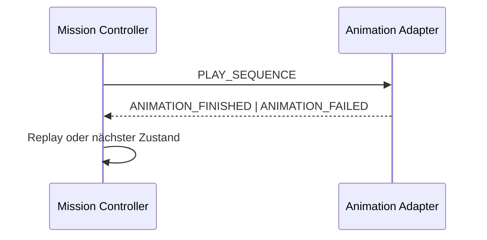

# Animation System

Animationen sind deterministische Lernschritte hinter `AnimationPlayerPort`, keine versteckten
Komponentenworkflows.

```ts
interface AnimationSequence {
  id: string;
  steps: readonly AnimationStep[];
  reducedMotion: ReducedMotionPlan;
  maxDurationMs: number;
}
```

## Handshake



- Jede Sequenz besitzt stabile ID und definierten Endzustand.
- Replay erzeugt denselben fachlichen Zustand.
- Fehler stellen den Endzustand her und blockieren den Lernpfad nicht.
- Zufällige Darstellungen verwenden einen injizierten Seed.
- Wartephasen stehen in der Sequenz, nicht als verstreute Komponenten-Timeouts.
- Verdeckte Tabs dürfen Bewegung pausieren; Timing folgt dem Timing-Protokoll.
- Reduced Motion entfernt Staffelung und Dekoration, niemals Inhalt.

Alle Buttons erhalten konsistentes Hover-, Active- und Fokusfeedback. Die klickbare Fläche bleibt
stabil; Animation darf ein Ziel nicht unter dem Zeiger oder Fokus wegbewegen.

Segmentbezogene Abläufe liegen in den versionierten Trainingsdaten und Statecharts, nicht in
diesem Systemdokument.
