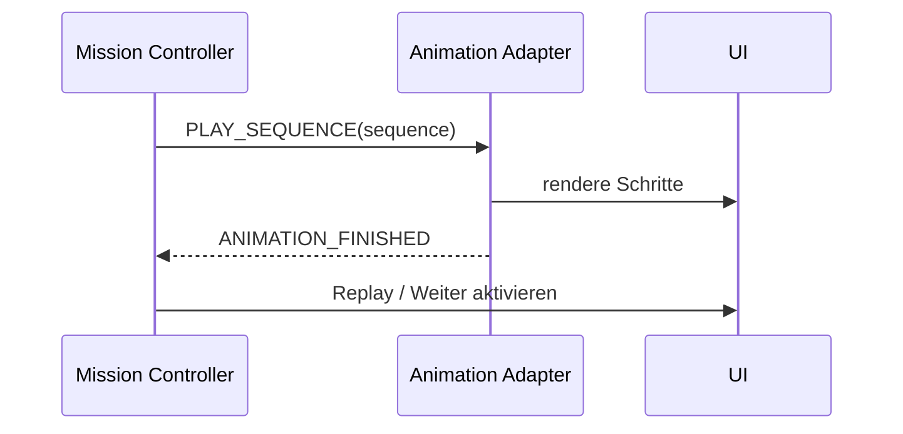

# Animation System

## Ziel

Animationen sind reproduzierbare Lernschritte, nicht dekorative Nebenwirkungen einzelner
Komponenten.

## Domänenmodell

```ts
interface AnimationSequence {
  id: string;
  steps: readonly AnimationStep[];
  reducedMotion: ReducedMotionPlan;
  maxDurationMs: number;
}
```

Typische Steps:

- `move-character`;
- `reveal` / `hide`;
- `highlight`;
- `set-node-status`;
- `draw-edge`;
- `pulse`;
- `wait-for-user`;
- `announce`.

## Handshake



Die Mission wartet niemals auf einen willkürlichen Timeout in einer Komponente. Der Adapter muss
bei Abbruch oder Fehler einen definierten Endzustand herstellen.

## Regeln

- Jede Sequenz hat stabile ID und erwarteten Endzustand.
- Ein Replay erzeugt denselben fachlichen Zustand.
- Zufallsdarstellungen verwenden einen Seed, wenn sie für Tests oder Studienvergleich relevant
  sind.
- Lange Wartephasen sind Contentkonfiguration und nicht im Renderer versteckt.
- Reduced Motion darf keine Information entfernen.
- Animationen können pausiert werden, wenn der Tab verborgen ist; die primäre Artefaktzeit läuft
  dennoch als Wall-Clock weiter.

## Design Lab

Jede komplexe Sequenz erhält eine deterministische Route oder Query im `/design-lab`, sodass
Screenshots und visuelle Regression ohne kompletten Trainingsdurchlauf möglich sind.
